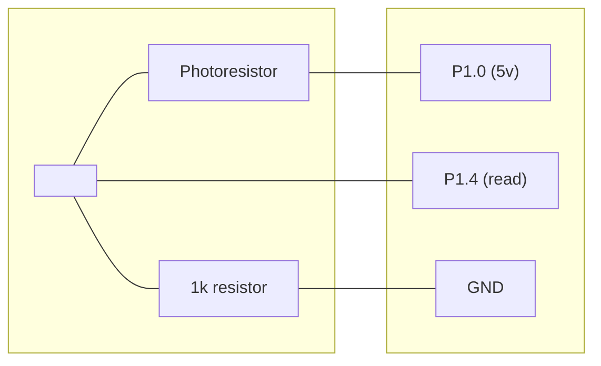

# Sunscreen

Automatically adjust your monitors' brightness based on the surrounding light.

# Overview

- **Server**: Runs on an MCU and provides light level readings via a serial interface over USB
- **Client**: Runs on your computer, periodically polling the server for the current light level and adjusting the monitor's brightness accordingly

Refer to their respective README.md for more information.

# Hardware
- CH552 board
- Photoresistor
- 1K ohm resistor

## Wiring diagram
